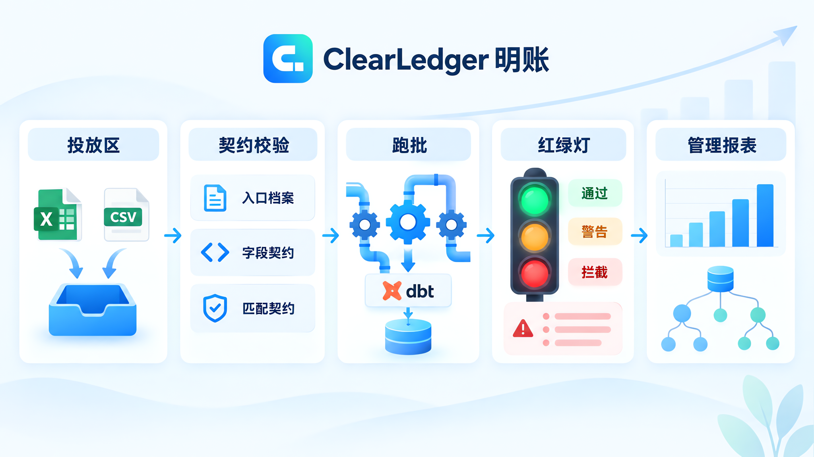
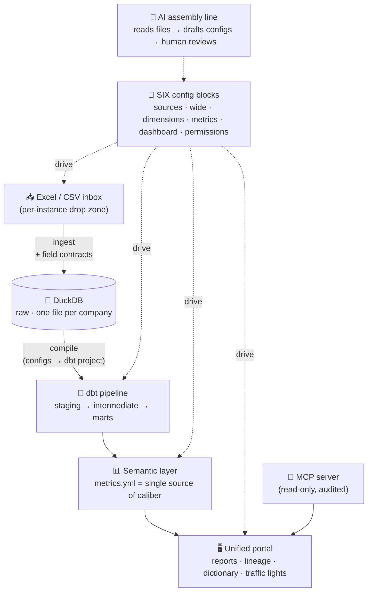
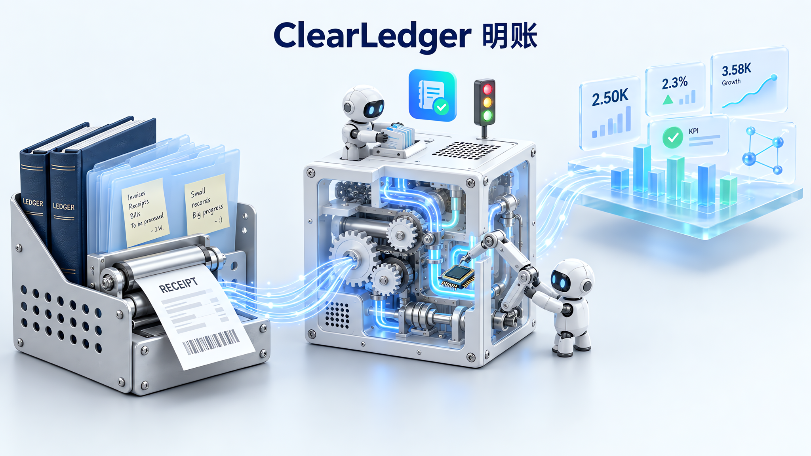
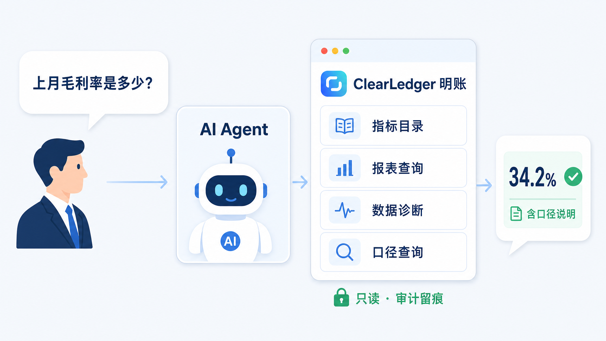

<div align="center">


# ClearLedger · 明账

**Every number, traceable to its source. · 每个数字，表里如一。**

An AI-Native reporting data platform — turn messy Excel/CSV drops into governed,
lineage-tracked management reports, assembled almost entirely from configuration.

[](LICENSE)
[](#-roadmap)
[](https://python.org)
[](#-architecture)
[](#-connect-your-ai-agent)
[](README.md)

English · [中文](README.md)


</div>

---

> [!NOTE]
> **This is a working early-access build (开发中 · 抢鲜体验).** It already runs four live company
> instances (sales / F&B chain / retail / HRO) with red-yellow-green data governance.
> See the [Roadmap](#-roadmap) for what's landed and what's next.

## 📸 What it looks like

| Overview | Lineage graph |
|---|---|
|  |  |

| Reports | Metric caliber popup |
|---|---|
|  |  |

## 🎯 Why ClearLedger

Hi, I'm the author.

I do business planning at my company; my day job is turning ideas into numbers and presenting those numbers to the boss.

Last year a new project needed management reports. The proper way to do this is well known: land data in DuckDB, transform with dbt, write calibers as models, hang a dashboard on top. The tools are all open source and ready; I can tinker with them myself.

But actually maintaining that stack is another story: pipelines need someone to run them, configs need someone to change them, errors need someone to chase them. Every piece is ongoing ops. For people who just want the report done, it doesn't add up — so the request goes to engineering, and the schedule comes back a year out.

Before that, I built automations with low-code platforms like PowerBI, Alteryx, and FineDataLink. They run, but they are nowhere near AI-native: everything lives inside their own canvas and private formats, which AI can neither read nor edit, so every change still needs a human. I also tried letting an agent write the automation scripts directly, and stepped into the pit on the other side: as context grows it forgets, sometimes it doesn't listen, and the numbers quietly go wrong. In reporting, wrong numbers are unacceptable. Hardcoded scripts are stable, but the pipeline becomes a black box — where it's stuck, where the data came from, all buried in code.

ClearLedger exists for exactly this spot:

| | Low-code platforms | Pure agent automation | Handwritten scripts | ClearLedger |
|---|---|---|---|---|
| AI can read & edit directly | ❌ private canvas formats | ⚠️ can write, may freelance | ⚠️ risky to refactor | ✅ six plain-text configs |
| Data reliability | ✅ | ❌ loses context, disobedient | ✅ | ✅ calibers live in the system, not in the agent's memory |
| Pipeline visibility | ⚠️ exists, black box inside | ❌ | ❌ | ✅ traffic lights + lineage, bottlenecks at a glance |
| Cost of a new project | high, redraw | — | high, rewrite | low, swap six configs |

The approach: standardize the engineering work into config blocks — five plain-text YAML files (sources, wide table, dimensions, metrics, dashboard) plus one instance manifest. Agents can read and edit them directly, and so can you. Permissions, the sixth block, is on the roadmap. A new project swaps six configs and runs; the engine doesn't change a line. Day to day, you drop files, define calibers, and watch the lights; building pipelines, editing configs, fixing errors — that's the agent's job. Calibers have a single source of truth, data has lineage, ingestion has contracts. None of the engineering discipline is missing; it just doesn't need your hands.


If you:

- spend days every month stitching Excel reports that break on every caliber change
- filed a reporting request with engineering and the schedule is far away while the business waits
- run a new project or business line the main systems won't reach for a while, and need a data view running first
- have calibers living in people's heads, so reporting dies when anyone takes leave

give ClearLedger a try.

The project is early: four demo instances are built in, the full chain — ingest, validate, run, report, lineage — works end to end, but it is not a mature product yet. See the end of this page for boundaries and the roadmap. Issues are welcome.

<div align="center">

<sub>Every batch passes the same road: drop → three contracts → run → traffic lights.</sub>
</div>

## ⚙️ Architecture



The engine (`semantic/`) contains **zero business logic**. Everything company-specific lives in
**six config blocks** per instance — the engine is generic, the assembly is done by AI.

## 🧱 The six building blocks

<div align="center">

<sub>Six plain-text configs, one generic engine — swap the company, swap the configs, the engine unchanged.</sub>
</div>

| Block | File | What it controls |
|---|---|---|
| ① Sources | `sources.yml` | File discovery patterns, cleaning pipeline, field contracts (type / range / enum / missing policy), problem severity levels |
| ② Wide table | `wide.yml` | Declarative joins (ordered left-joins with match contracts: fanout / null-match / orphan) + derived columns |
| ③ Dimensions | `dimensions.yml` | Which columns become sliceable dimensions (drill-down, filters, grouping — zero presets) |
| ④ Metrics | `metrics.yml` | The single source of caliber: each metric = one formula + one Chinese/English description shown in the UI |
| ⑤ Dashboard | `dashboard.yml` | Reports = dimension × metrics × filters × chart type |
| ⑥ Permissions | `permissions.yml` | *(planned v0.7)* Row/column-level access, unified principal for humans and API keys |

**Three data contracts** run on every batch: entry档案 (file-name patterns that survive monthly renames,
ordered cleaning primitives, severity per problem class), field contracts (validated on ingest, violations
logged to `raw.contract_report`), and match contracts (fan-out → red test, null-match → warn + list).

Swap company = swap configs. The engine's `git diff` must be zero — that's the acceptance gate.

## 🚀 Quick start

ClearLedger is AI-native: building and maintaining configs and pipelines is designed to be an agent's job. Three ways to ignite, from easiest to hardcore (all need Python 3.11+ on the machine):

**Option 1: hand it to your AI agent (recommended)**

Point any coding agent (ZCode / Claude Code / Cursor…) at the repo root and say:

> Read docs/AI-点火指南.md and get me up and running.

It walks itself through: environment bootstrap → demo data → first pipeline run → portal acceptance, with checkpoints along the way. This is the intended usage — swapping in real data, changing calibers, fixing errors later, all go through the agent too.

**Option 2: double-click `启动明账.exe` (Windows)**

Download the exe from the GitHub Releases page (Releases → latest launcher build) and drop it in the repo root, then double-click. A GUI bootstrap window does the same thing and opens `http://127.0.0.1:8620` in your browser. First run takes ~10–25 minutes; afterwards it's seconds. Some antivirus tools false-flag single-file exes — allow it; the source is this very repo.

**Option 3: bare commands**

<details>
<summary>Do it manually (equivalent to what the agent does)</summary>

```bash
git clone https://github.com/August06exe/clearledger.git
cd clearledger
python -m venv .venv && .venv/Scripts/python -m pip install -r requirements.txt   # Windows
# or: python -m venv .venv && .venv/bin/python -m pip install -r requirements.txt # Linux/macOS

# generate demo data for two live instances (sales & F&B chain) and run the full pipeline
.venv/Scripts/python sample_data/generate.py
.venv/Scripts/python sample_data/generate_restaurant.py
.venv/Scripts/python -m semantic.ingest_run  --instance sales
.venv/Scripts/python -m semantic.compile_dbt --instance sales
cd instances/sales/pipeline && ../../../.venv/Scripts/dbt.exe build --profiles-dir . && cd ../../../..

# start the portal
.venv/Scripts/python -m uvicorn app.main:app --host 127.0.0.1 --port 8620
# open http://127.0.0.1:8620
```

</details>

> On first open, the portal shows a banner explaining how to plug your agent in (also always available under the "AI 接入" page in the left nav).

## 📖 How you use it: a day with ClearLedger

Once it's running, only three things are yours — everything else is the agent's.

**① Drop files (monthly or daily)**

Drop the Excel/CSV exports from your business systems into the instance inbox
`instances/<instance>/data/inbox/`. Monthly filename drift
(`sales_detail_2026-09.xlsx` → `…2026-10…`) is fine — the entry-archive discovery
patterns absorb it. Missing files or format drift get caught by field contracts at
ingest and logged, never silently loaded.

**② Run the pipeline, watch the lights**

Hit "▶ 立即跑批" (run now) in the portal, or switch to a daily schedule with ⏰
(missed runs catch up on boot). Then read the traffic light:

| Light | Meaning | What you do |
|---|---|---|
| 🟢 green | all passed, reports are out | use them |
| 🟡 yellow | warnings (e.g. null-match lists) | open "跑批历史" for details; fix the data or hand it to the agent |
| 🔴 red | run failed | paste the symptom to your agent — with AGENTS.md it knows how to fix it |

**③ Read the reports**

The "管理报表" page serves dimension × metric tables with filters, instance
switching, and one-click Excel export. Any number you don't understand — click the
metric name and a **plain-language caliber note** pops up. Calibers live in the
system, not in people's heads. The "数据血缘" page traces every number back to its
source tables and columns.

**Want something changed? Ask the agent.**

| You want | You say |
|---|---|
| change/add a metric | "Edit instances/sales/metrics.yml: gross margin should be … then recompile and rerun" |
| add a report | "Add a Region × Gross Margin monthly table to dashboard.yml" |
| onboard a new company | "Read R-11 in docs/AI-操作手册.md and draft the six configs for the files in the inbox" |

The guardrails hold regardless: calibers live only in `metrics.yml`, reports read
the marts layer only, every batch passes three contracts — however the agent
tinkers, numbers can't quietly go wrong. Full recipes in
[docs/AI-操作手册.md](docs/AI-操作手册.md).

## 🔌 Connect your AI agent

ClearLedger ships an MCP server (stdio, read-only, fully audited). Four tools your agent gets:
**metric catalog** (with human-readable caliber), **report query** (declared dimensions × metrics only —
row-level data is architecturally unreachable), **data health diagnosis** ("what's missing this period?"),
and **caliber lookup**.

<div align="center">

<sub>Read-only queries over declared dimensions × metrics, answers with caliber attached — every call audited.</sub>
</div>

```json
{ "mcpServers": { "clearledger": {
    "command": "C:/path/to/clearledger/.venv/Scripts/python.exe",
    "args": ["C:/path/to/clearledger/mcp_server.py"] } } }
```

Prefer plain HTTP? Enable `data/openapi_keys.json` (see `openapi_keys.example.json`) and call
`/api/open/*` with an `X-API-Key` header. Every call is audit-logged.

## 📍 Roadmap

| Version | Codename | Theme | Status |
|---|---|---|---|
| v0.1 | First bucket | End-to-end minimal loop | ✅ shipped |
| v0.2 | Visible | Unified portal: lineage / traffic lights / dictionary / reports | ✅ shipped |
| v0.3 | Generic blocks | Six configs + semantic engine + multi-instance + account switching | ✅ shipped |
| v0.4 | AI assembly line | Onboarding inspector + open MCP + UI localization (Chinese alias layer) | ✅ shipped |
| v0.5 | Config workbench | Visual management & editing for configs and contracts | ⏳ planned |
| v0.6 | Complex rules | Allocation / restatement / reconciliation engines | ⏳ planned |
| v0.7 | Multi-user & permissions | Sixth block: permissions.yml, unified portal (hide-only ACL) | ⏳ planned |
| v1.0 | GA | Production hardening + always-on AI self-audit | ⏳ planned |

Full narrative roadmap (investor edition, CN): [docs/产品路线图-投资人版.md](docs/产品路线图-投资人版.md)

## 🤝 Contributing

Early days — the codebase is being shaped fast. Issues and ideas are welcome; please read
[AGENTS.md](AGENTS.md) (our AI-Native engineering charter) and the
[AI operations manual](docs/AI-操作手册.md) first: they explain the architecture, the red lines
(single-source caliber), and the operational recipes.


## 🙏 致谢 · 站在开源巨人的肩膀上

明账是开源方法的受益者，也是回馈者。本项目的地基与方法论，直接构建在这些项目之上：

**构建于（运行时依赖）**

[](https://github.com/duckdb/duckdb) ⭐ 30k+
[](https://github.com/dbt-labs/dbt-core) ⭐ 10k+
[](https://github.com/fastapi/fastapi) ⭐ 80k+
[](https://github.com/apache/echarts) ⭐ 62k+
[](https://github.com/antvis/G6) ⭐ 11k+
[](https://github.com/tobymao/sqlglot) ⭐ 7k+
[](https://github.com/agronholm/apscheduler) ⭐ 6.2k
[](https://github.com/pandas-dev/pandas) ⭐ 45k+

**方法论借鉴**

[-8B5CF6.svg)](https://github.com/UKGovernmentBEIS/inspect_ai) —— the Task/Solver/Scorer separation inspired our evaluation architecture
[-7C3AED.svg)](https://github.com/HypothesisWorks/hypothesis) ⭐ 7.8k —— independent oracle + generative inputs → our acceptance-answer generation
[](https://github.com/topics/agent-testing) —— 对抗注入思路 → 混沌条款

> One line: **the engines are theirs, the blocks are config, the assembly is AI's.**
> 感谢以上项目的维护者与社区——明账每个版本都会同步更新这份名单。


## 📄 License

[MIT](LICENSE) — use it, fork it, build your business on it.

---

<div align="center">
<sub>Built by a human who can't read code, with an AI who reads everything. · 一个不写代码的人，和一个读所有代码的 AI。</sub>
</div>
