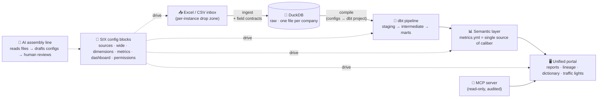

<div align="center">


# ClearLedger · 明账

**Every number, traceable to its source. · 每个数字，表里如一。**

An AI-Native reporting data platform — turn messy Excel/CSV drops into governed,
lineage-tracked management reports, assembled almost entirely from configuration.

[](LICENSE)
[](#-roadmap)
[](https://python.org)
[](#-architecture)
[](#-connect-your-ai-agent)
[](README.zh-CN.md)

[English](README.md) · [中文](README.zh-CN.md)


</div>

---

> [!NOTE]
> **This is a working early-access build (开发中 · 抢鲜体验).** It already runs four live company
> instances (sales / F&B chain / retail / HRO) with red-yellow-green data governance, and is under
> an adversarial three-agent test protocol with a 3-consecutive-100% gate. See the
> [Roadmap](#-roadmap) for what's landed and what's next.

## 📸 What it looks like

| Overview | Lineage graph |
|---|---|
|  |  |

| Reports | Metric caliber popup |
|---|---|
|  |  |

## 🤔 Why

Management reporting in most companies is still a human relay race: export from business systems,
massage in Excel, pass around, merge, pray. The result is slow, opaque ("how was this number even
computed?"), fragile (one person on leave = reporting stops), and **unrepeatable** — every company
rebuilds the same wheel.

ClearLedger replaces that relay with an AI-assembled, config-driven pipeline:

- **Drop Excel/CSV files into an inbox** → they are cleaned, contract-checked, and loaded automatically
- **Every metric has exactly one definition** (a YAML config, not SQL buried in someone's spreadsheet)
- **Every number is traceable** — click any field and walk its lineage back to the source column
- **Traffic-light governance** — 🟢 pass · 🟡 data-quality warning (with AI-attributed cause) · 🔴 pipeline
  failure (downstream blocked, reports explicitly marked *stale*, never silently old)
- **Your AI agent can plug in** — ClearLedger ships an [MCP server](#-connect-your-ai-agent) so Claude
  Code, Codex, Hermes, or any MCP client can query metrics and diagnose data health in natural language

## ⚙️ Architecture



The engine (`semantic/`) contains **zero business logic**. Everything company-specific lives in
**six config blocks** per instance — the engine is generic, the assembly is done by AI.

## 🧱 The six building blocks

| Block | File | What it controls |
|---|---|---|
| ① Sources | `sources.yml` | File discovery patterns, cleaning pipeline, field contracts (type / range / enum / missing policy), problem severity levels |
| ② Wide table | `wide.yml` | Declarative joins (ordered left-joins with match contracts: fanout / null-match / orphan) + derived columns |
| ③ Dimensions | `dimensions.yml` | Which columns become sliceable dimensions (drill-down, filters, grouping — zero presets) |
| ④ Metrics | `metrics.yml` | The single source of caliber: each metric = one formula + one Chinese/English description shown in the UI |
| ⑤ Dashboard | `dashboard.yml` | Reports = dimension × metrics × filters × chart type |
| ⑥ Permissions | `permissions.yml` | *(planned v0.7)* Row/column-level access, unified principal for humans and API keys |

**Three data contracts** run on every batch: entry档案 (file-name patterns that survive monthly renames,
ordered cleaning primitives, severity per problem class), field contracts (validated on ingest, violations
logged to `raw.contract_report`), and match contracts (fan-out → red test, null-match → warn + list).

Swap company = swap configs. The engine's `git diff` must be zero — that's the acceptance gate.

## 🚀 Quick start

```bash
git clone https://github.com/August06exe/clearledger.git
cd clearledger
python -m venv .venv && .venv/Scripts/python -m pip install -r requirements.txt   # Windows
# or: python -m venv .venv && .venv/bin/python -m pip install -r requirements.txt # Linux/macOS

# generate demo data for two live instances (retail & F&B chain) and run the full pipeline
.venv/Scripts/python sample_data/generate.py
.venv/Scripts/python sample_data/generate_restaurant.py
.venv/Scripts/python -m semantic.ingest_run  --instance sales
.venv/Scripts/python -m semantic.compile_dbt --instance sales
cd instances/sales/pipeline && ../../.venv/Scripts/dbt.exe build --profiles-dir . && cd ../../..

# start the portal
.venv/Scripts/python -m uvicorn app.main:app --host 127.0.0.1 --port 8620
# open http://127.0.0.1:8620
```

> On Windows, double-click **`启动明账.bat`** — it does all of the above and opens your browser.

## 🔌 Connect your AI agent

ClearLedger ships an MCP server (stdio, read-only, fully audited). Four tools your agent gets:
**metric catalog** (with human-readable caliber), **report query** (declared dimensions × metrics only —
row-level data is architecturally unreachable), **data health diagnosis** ("what's missing this period?"),
and **caliber lookup**.

```json
{ "mcpServers": { "clearledger": {
    "command": "C:/path/to/clearledger/.venv/Scripts/python.exe",
    "args": ["C:/path/to/clearledger/mcp_server.py"] } } }
```

Prefer plain HTTP? Enable `data/openapi_keys.json` (see `openapi_keys.example.json`) and call
`/api/open/*` with an `X-API-Key` header. Every call is audit-logged.

## 🧪 How we test it (no self-grading allowed)

Every release passes an adversarial **three-agent protocol**:

| Agent | Knows the code? | Knows the answers? | Memory |
|---|---|---|---|
| 🔮 Question Setter | ❌ forbidden | ✅ computes sealed answers independently (pure pandas, never via the engine) | kept across rounds |
| 🧪 Test Runner | ❌ forbidden | ❌ **forbidden — sealed until scoring** | ❌ **fresh spawn every round (first-strike kill)** |
| ⚖️ Reviewer | ✅ | ✅ at scoring time | kept, but every verdict must cite mechanical evidence |

Answers are sealed with SHA256 manifests; numeric scoring is done by a frozen diff script
(tolerance 0.01 / 1e-6) — never by an LLM grading numbers. The gate: **3 consecutive rounds at
100%**, with the question-setter deepening the chaos every round. Last gate: **357 → 381 → 357,
all 100%**. See [tests/v0.4/](tests/v0.4) for sealed answers, generators, and judge scripts.

## 📍 Roadmap

| Version | Codename | Theme | Status |
|---|---|---|---|
| v0.1 | First bucket | End-to-end minimal loop | ✅ shipped |
| v0.2 | Visible | Unified portal: lineage / traffic lights / dictionary / reports | ✅ shipped |
| v0.3 | Generic blocks | Six configs + semantic engine + multi-instance + account switching | ✅ shipped |
| v0.4 | AI assembly line | Onboarding inspector + open MCP read-only interface | 🔨 in progress |
| v0.5 | Config workbench | Visual management & editing for configs and contracts | ⏳ planned |
| v0.6 | Complex rules | Allocation / restatement / reconciliation engines | ⏳ planned |
| v0.7 | Multi-user & permissions | Sixth block: permissions.yml, unified portal (hide-only ACL) | ⏳ planned |
| v1.0 | GA | Production hardening + always-on AI self-audit | ⏳ planned |

Full narrative roadmap (investor edition, CN): [docs/产品路线图-投资人版.md](docs/产品路线图-投资人版.md)

## 🤝 Contributing

Early days — the codebase is being shaped fast. Issues and ideas are welcome; please read
[AGENTS.md](AGENTS.md) (our AI-Native engineering charter) and the
[AI operations manual](docs/AI-操作手册.md) first: they explain the architecture, the red lines
(single-source caliber, sealed-answer discipline), and the operational recipes.

## 📄 License

[MIT](LICENSE) — use it, fork it, build your business on it.

---

<div align="center">
<sub>Built by a human who can't read code, with an AI who reads everything. · 一个不写代码的人，和一个读所有代码的 AI。</sub>
</div>
