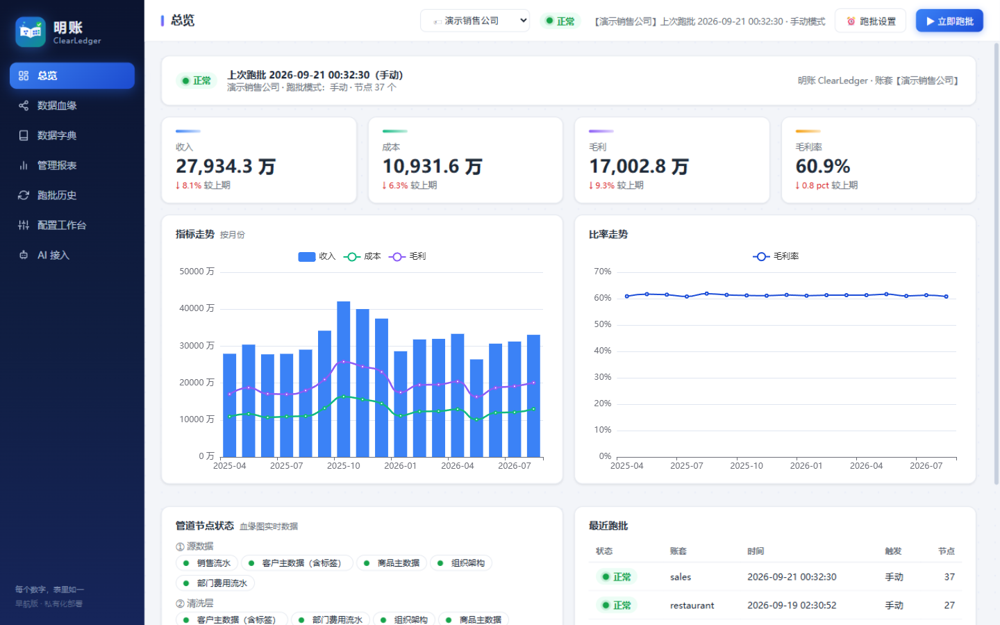
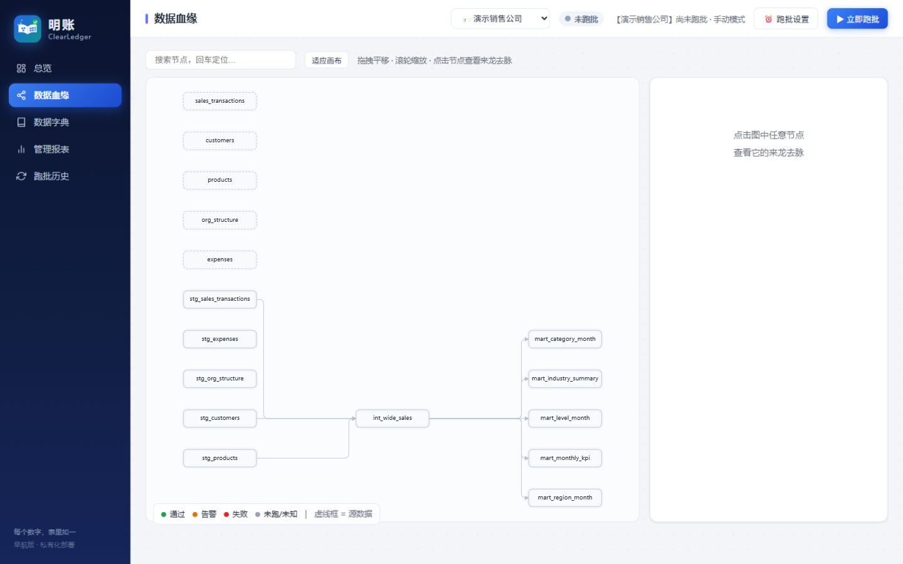
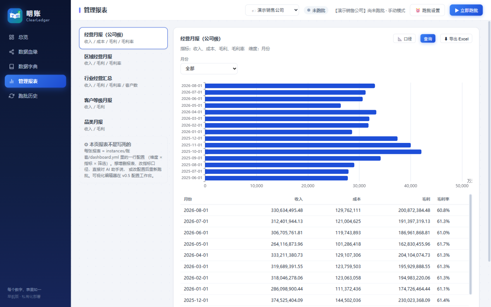
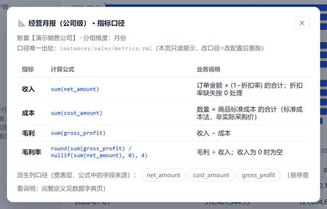
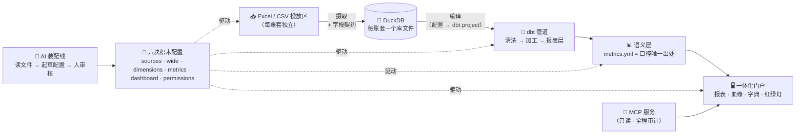

<div align="center">


# 明账 ClearLedger

**每个数字，表里如一。—— AI Native 的管理报表数据底座**

把杂乱的 Excel/CSV 投放，变成有治理、可追溯血缘的管理报表——几乎全部由配置装配而成。

[](LICENSE)
[](#-更新计划)
[](https://python.org)
[](#️-架构一页看懂)
[](#-让你的ai-agent连上来)
[](README.en.md)

中文 · [English](README.en.md)


</div>

---

> [!NOTE]
> **当前为开发中版本（抢鲜体验 Early Access）**。已有 4 个真实运转的公司账套实例
> （销售 / 连锁餐饮 / 零售进销存 / 人力外包），跑批红绿灯治理完整。更新计划见[文末](#-更新计划)。

## 🎯 写给每一个等过报表的人

> 周一晨会。老板问："上个月华东的数出来了吗？"
> 你说："在弄了，表在财务那儿，我催一下。"

这样的对话，你大概不陌生。下面这些场景，总有一个眼熟：

- 🌙 **每月月初那三天**——十几个群、几十个 Excel、无数个 vlookup，拼出一份下个月就作废的报表
- 📅 **需求提了半年**——产研说"下个季度"，再问就是"优先级排不开"。可业务不会等排期
- 🚀 **新业务刚起步**——总部的系统三年内覆盖不到这儿，但老板现在就要看数
- 🧩 **口径全靠口口相传**——"毛利怎么算的？""问老王。"老王休年假了，报表就断供

大公司小公司都会遇到，业务跑在系统前面的时候尤其如此。明账就是为这些时刻造的。


**过渡期，也可以很体面。**

作者自己的故事：新项目要报表，产研排期排到了一年以后。业务等不起，于是这个不会写代码的
BP，带着一个 AI，把"投放 → 清洗 → 口径 → 报表 → 血缘"整条流水线搭了起来。
从那以后，月初那三天，变成了三分钟。

而且它不把你锁死在过渡里：**所有口径、血缘、契约，都躺在配置文件里**。
哪天正式平台到位了，这些资产原样交得出去——过渡期用明账，不留技术债。

> **排期等不来的时候，先让数据跑起来。**

不需要会 SQL，不需要立项，不需要养运维。你的 AI 助手读得懂全部配置，出问题它会修；
你只做一件事：定义"这个数应该怎么算"。

## 📸 产品实拍

| 总览 · 红绿灯 | 血缘蜘蛛网（可下钻到字段级） |
|---|---|
|  |  |

| 管理报表 · 一键导出 | 指标口径 · 界面可查 |
|---|---|
|  |  |

## ⚙️ 架构（一页看懂）



**引擎（semantic/）零业务预设**。一切随公司变化的东西，收敛为每账套的**六块配置积木**——
引擎通用，装配交给 AI。

## 🧱 六块积木

| 积木 | 文件 | 管什么 |
|---|---|---|
| ① 数据源 | `sources.yml` | 文件发现模式（扛月度改名）、清洗管道、字段契约（类型/范围/枚举/缺失策略）、问题定级 |
| ② 宽表 | `wide.yml` | 声明式关联（有序左联+匹配契约：扇出/匹空/孤儿）+ 派生列 |
| ③ 维度 | `dimensions.yml` | 哪些列变成可切片的维度（下钻/筛选/分组——零预设） |
| ④ 指标 | `metrics.yml` | 口径唯一出处：指标 = 一条公式 + 一段界面可查的中文说明 |
| ⑤ 看板 | `dashboard.yml` | 报表 = 维度 × 指标 × 筛选 × 图表 |
| ⑥ 权限 | `permissions.yml` | *（v0.7 规划）* 行列级访问，人与 API 钥匙统一主体 |

**三层数据契约**每批必查：入口档案（扛文件名月度漂移的发现模式、有序清洗原语、逐类问题定级）、
字段契约（摄取即校验，违规留痕 `raw.contract_report`）、匹配契约（扇出→红灯测试、匹空→黄灯+清单）。

换公司 = 换配置。引擎的 `git diff` 必须为零——这是硬验收闸门。

## 🚀 快速开始

```bash
git clone https://github.com/August06exe/clearledger.git
cd clearledger
python -m venv .venv && .venv/Scripts/python -m pip install -r requirements.txt   # Windows

# 生成两套演示账套数据（销售公司 + 连锁餐饮）并跑通全链路
.venv/Scripts/python sample_data/generate.py
.venv/Scripts/python sample_data/generate_restaurant.py
.venv/Scripts/python -m semantic.ingest_run  --instance sales
.venv/Scripts/python -m semantic.compile_dbt --instance sales
cd instances/sales/pipeline && ../../.venv/Scripts/dbt.exe build --profiles-dir . && cd ../../..

# 启动门户
.venv/Scripts/python -m uvicorn app.main:app --host 127.0.0.1 --port 8620
# 浏览器打开 http://127.0.0.1:8620
```

> Windows 用户直接双击 **`启动明账.bat`**——以上全部自动完成并打开浏览器。

## 🔌 让你的 AI agent 连上来

明账内置 MCP 服务（stdio、只读、全程审计）。你的 agent 获得六个工具：
**指标目录**（含中文口径）、**报表查询**（只能查已声明的维度×指标——明细行在架构上就摸不到）、
**数据健康诊断**（"这期报表为什么没出？"）、**口径查询**。

```json
{ "mcpServers": { "clearledger": {
    "command": "C:/path/to/clearledger/.venv/Scripts/python.exe",
    "args": ["C:/path/to/clearledger/mcp_server.py"] } } }
```

偏好 HTTP？启用 `data/openapi_keys.json`（见 `openapi_keys.example.json`），带 `X-API-Key`
调用 `/api/open/*`。每次调用都有审计留痕。

## 📍 更新计划

| 版本 | 代号 | 主题 | 状态 |
|---|---|---|---|
| v0.1 | 第一桶数据 | 端到端最小闭环 | ✅ 已交付 |
| v0.2 | 看得见 | 一体化门户：血缘/红绿灯/字典/报表 | ✅ 已交付 |
| v0.3 | 通用积木 | 六配置+语义引擎+多账套+账套切换 | ✅ 已交付 |
| v0.4 | AI 装配线 | 接入体检器 + 开放 MCP + **界面中文化（血缘/字段/状态中文别名）** | 🔨 进行中 |
| v0.5 | 配置工作台 | 配置与契约的可视化管理和编辑 | ⏳ 计划中 |
| v0.6 | 复杂规则 | 分摊 / 重算 / 对账引擎化 | ⏳ 计划中 |
| v0.7 | 多用户与权限 | 第六块积木：permissions.yml、统一门户 | ⏳ 计划中 |
| v1.0 | 正式版 | 生产加固 + AI 自审常态化 | ⏳ 计划中 |

完整叙事版（投资人向）：[docs/产品路线图-投资人版.md](docs/产品路线图-投资人版.md)

## 🤝 参与

项目还在快速成形期，欢迎 Issue 与想法。动手前请先读
[AGENTS.md](AGENTS.md)（AI-Native 工程章程）与
[AI 操作手册](docs/AI-操作手册.md)：架构、红线（口径唯一出处）、操作配方都在里面。

## 🙏 致谢 · 站在开源巨人的肩膀上

明账是开源方法的受益者，也是回馈者。本项目的地基与方法论，直接构建在这些项目之上：

**构建于（运行时依赖）**

[](https://github.com/duckdb/duckdb) ⭐ 30k+
[](https://github.com/dbt-labs/dbt-core) ⭐ 10k+
[](https://github.com/fastapi/fastapi) ⭐ 80k+
[](https://github.com/apache/echarts) ⭐ 62k+
[](https://github.com/antvis/G6) ⭐ 11k+
[](https://github.com/tobymao/sqlglot) ⭐ 7k+
[](https://github.com/agronholm/apscheduler) ⭐ 6.2k
[](https://github.com/pandas-dev/pandas) ⭐ 45k+

**方法论借鉴**

[-8B5CF6.svg)](https://github.com/UKGovernmentBEIS/inspect_ai) —— Task/Solver/Scorer 三段分离，启发了我们的评估架构
[-7C3AED.svg)](https://github.com/HypothesisWorks/hypothesis) ⭐ 7.8k —— 独立 oracle + 随机生成 → 验收答案的独立生成
[](https://github.com/topics/agent-testing) —— 对抗注入思路 → 混沌测试条款

> 一句话：**引擎是它们的，积木是配置的，装配是 AI 的。**
> 感谢以上项目的维护者与社区——明账每个版本都会同步更新这份名单。

## 📄 协议

[MIT](LICENSE) —— 随便用，随便改，拿去做生意也行。

---

<div align="center">
<sub>一个不写代码的人，和一个读所有代码的 AI，一起造的。<br>Built by a human who can't read code, together with an AI who reads everything.</sub>
</div>
