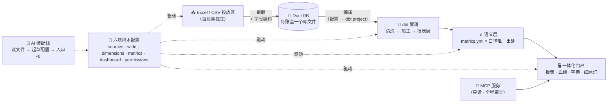

<div align="center">


# 明账 ClearLedger

**每个数字，表里如一。—— AI Native 的管理报表数据底座**

把杂乱的 Excel/CSV 投放，变成有治理、可追溯血缘的管理报表——几乎全部由配置装配而成。

[](LICENSE)
[](#-更新计划)
[](https://python.org)
[](#️-架构一页看懂)
[](#-让你的ai-agent连上来)
[](README.md)

[中文](README.zh-CN.md) · [English](README.md)


</div>

---

> [!NOTE]
> **当前为开发中版本（抢鲜体验 Early Access）**。已有 4 个真实运转的公司账套实例
> （销售 / 连锁餐饮 / 零售进销存 / 人力外包），跑批红绿灯治理完整，并通过
> 三 Agent 对抗式验收测试（连续 3 轮 100% 闸门）。更新计划见[文末](#-更新计划)。

## 📸 产品实拍

| 总览 · 红绿灯 | 血缘蜘蛛网（可下钻到字段级） |
|---|---|
|  |  |

| 管理报表 · 一键导出 | 指标口径 · 界面可查 |
|---|---|
|  |  |

## 🤔 为什么做这个

大多数公司的管理报表还在靠人肉接力：业务系统导出 → Excel 加工 → 微信传文件 → 拼装 → 祈祷。
结果是：**慢**（周期以天计）、**黑盒**（"这个数怎么算的"没人说得清）、**脆弱**（做表的人一休假就断供）、
**不可复制**（每家公司都在重造同一个轮子）。

明账把这条人肉流水线，换成 AI 装配、配置驱动的自动化管道：

- **Excel/CSV 丢进投放区** → 自动清洗、契约校验、入库——脏数据当场亮灯，绝不带病发布
- **每个指标只有一个定义**（在 YAML 配置里，不在某人的电子表格里），且**界面可查公式与说明**
- **每个数字可追溯**——点开任意字段，血缘图带你走回源文件的那一列
- **红绿灯治理**——🟢 通过 · 🟡 数据质量告警（附原因）· 🔴 管道失败（下游拦截，报表标"过期"，绝不拿旧数装新数）
- **你的 AI 助手可以插进来**——内置 [MCP 服务](#-让你的ai-agent连上来)，Claude Code、Codex、Hermes
  等 agent 用自然语言问数、诊断数据健康

## ⚙️ 架构（一页看懂）



**引擎（semantic/）零业务预设**。一切随公司变化的东西，收敛为每账套的**六块配置积木**——
引擎通用，装配交给 AI。

## 🧱 六块积木

| 积木 | 文件 | 管什么 |
|---|---|---|
| ① 数据源 | `sources.yml` | 文件发现模式（扛月度改名）、清洗管道、字段契约（类型/范围/枚举/缺失策略）、问题定级 |
| ② 宽表 | `wide.yml` | 声明式关联（有序左联+匹配契约：扇出/匹空/孤儿）+ 派生列 |
| ③ 维度 | `dimensions.yml` | 哪些列变成可切片的维度（下钻/筛选/分组——零预设） |
| ④ 指标 | `metrics.yml` | 口径唯一出处：指标 = 一条公式 + 一段界面可查的中文说明 |
| ⑤ 看板 | `dashboard.yml` | 报表 = 维度 × 指标 × 筛选 × 图表 |
| ⑥ 权限 | `permissions.yml` | *（v0.7 规划）* 行列级访问，人与 API 钥匙统一主体 |

**三层数据契约**每批必查：入口档案（扛文件名月度漂移的发现模式、有序清洗原语、逐类问题定级）、
字段契约（摄取即校验，违规留痕 `raw.contract_report`）、匹配契约（扇出→红灯测试、匹空→黄灯+清单）。

换公司 = 换配置。引擎的 `git diff` 必须为零——这是硬验收闸门。

## 🚀 快速开始

```bash
git clone https://github.com/August06exe/clearledger.git
cd clearledger
python -m venv .venv && .venv/Scripts/python -m pip install -r requirements.txt   # Windows

# 生成两套演示账套数据（销售公司 + 连锁餐饮）并跑通全链路
.venv/Scripts/python sample_data/generate.py
.venv/Scripts/python sample_data/generate_restaurant.py
.venv/Scripts/python -m semantic.ingest_run  --instance sales
.venv/Scripts/python -m semantic.compile_dbt --instance sales
cd instances/sales/pipeline && ../../.venv/Scripts/dbt.exe build --profiles-dir . && cd ../../..

# 启动门户
.venv/Scripts/python -m uvicorn app.main:app --host 127.0.0.1 --port 8620
# 浏览器打开 http://127.0.0.1:8620
```

> Windows 用户直接双击 **`启动明账.bat`**——以上全部自动完成并打开浏览器。

## 🔌 让你的 AI agent 连上来

明账内置 MCP 服务（stdio、只读、全程审计）。你的 agent 获得六个工具：
**指标目录**（含中文口径）、**报表查询**（只能查已声明的维度×指标——明细行在架构上就摸不到）、
**数据健康诊断**（"这期报表为什么没出？"）、**口径查询**。

```json
{ "mcpServers": { "clearledger": {
    "command": "C:/path/to/clearledger/.venv/Scripts/python.exe",
    "args": ["C:/path/to/clearledger/mcp_server.py"] } } }
```

偏好 HTTP？启用 `data/openapi_keys.json`（见 `openapi_keys.example.json`），带 `X-API-Key`
调用 `/api/open/*`。每次调用都有审计留痕。

## 🧪 我们怎么测试（不允许 AI 自己给自己打分）

每个版本必须通过对抗式**三 Agent 三权分立**验收：

| Agent | 知道实现吗 | 知道答案吗 | 记忆 |
|---|---|---|---|
| 🔮 命题 | ❌ 禁读实现 | ✅ 用纯 pandas 独立计算密封答案（绝不经过引擎） | 跨轮保留 |
| 🧪 测试 | ❌ 禁读实现 | ❌ **密封，判分前不准看** | ❌ 每轮全新（初见杀） |
| ⚖️ 评审 | ✅ | ✅ 判分时启封 | 保留，但结论必须引用机械证据 |

答案用 SHA256 清单密封；数值判分由冻结的判分脚本完成（容差 0.01/1e-6）——**绝不让 LLM 给数字打分**。
闸门：**连续 3 轮 100%**，且每轮命题必须加深混沌。最近一次闸门：**357 → 381 → 357，全部 100%**。
密封答案、生成器、判分脚本见 [tests/v0.4/](tests/v0.4)。

## 📍 更新计划

| 版本 | 代号 | 主题 | 状态 |
|---|---|---|---|
| v0.1 | 第一桶数据 | 端到端最小闭环 | ✅ 已交付 |
| v0.2 | 看得见 | 一体化门户：血缘/红绿灯/字典/报表 | ✅ 已交付 |
| v0.3 | 通用积木 | 六配置+语义引擎+多账套+账套切换 | ✅ 已交付 |
| v0.4 | AI 装配线 | 接入体检器 + 开放 MCP 只读接口 | 🔨 进行中 |
| v0.5 | 配置工作台 | 配置与契约的可视化管理和编辑 | ⏳ 计划中 |
| v0.6 | 复杂规则 | 分摊 / 重算 / 对账引擎化 | ⏳ 计划中 |
| v0.7 | 多用户与权限 | 第六块积木：permissions.yml、统一门户 | ⏳ 计划中 |
| v1.0 | 正式版 | 生产加固 + AI 自审常态化 | ⏳ 计划中 |

完整叙事版（投资人向）：[docs/产品路线图-投资人版.md](docs/产品路线图-投资人版.md)

## 🤝 参与

项目还在快速成形期，欢迎 Issue 与想法。动手前请先读
[AGENTS.md](AGENTS.md)（AI-Native 工程章程）与
[AI 操作手册](docs/AI-操作手册.md)：架构、红线（口径唯一出处、密封答案纪律）、操作配方都在里面。

## 📄 协议

[MIT](LICENSE) —— 随便用，随便改，拿去做生意也行。

---

<div align="center">
<sub>一个不写代码的人，和一个读所有代码的 AI，一起造的。<br>Built by a human who can't read code, together with an AI who reads everything.</sub>
</div>
